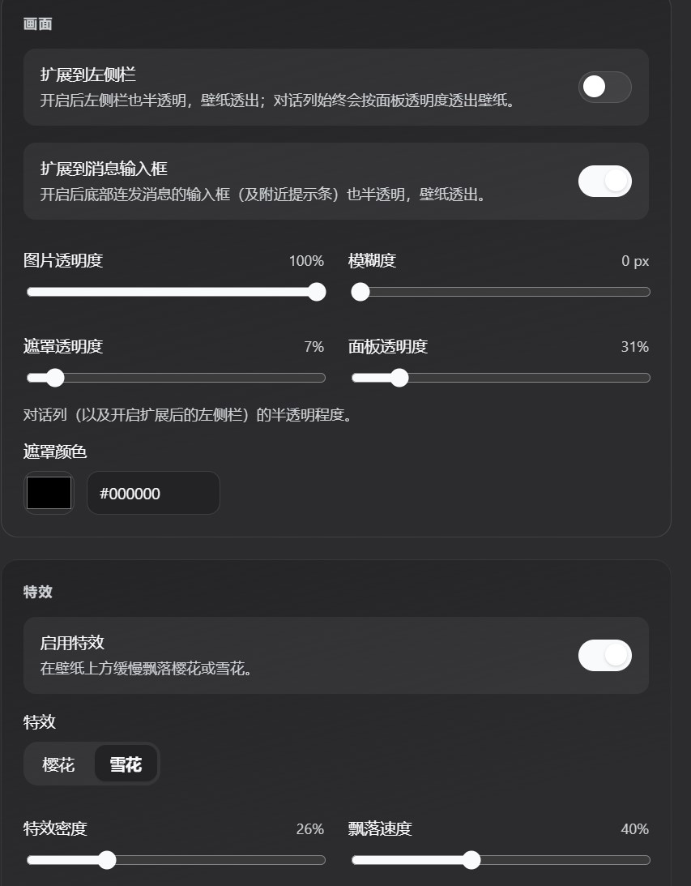
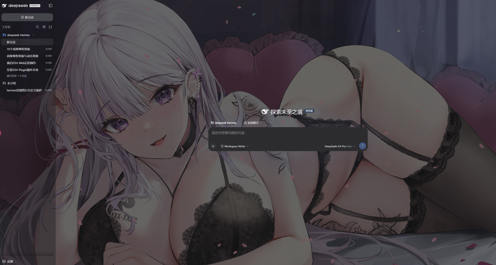
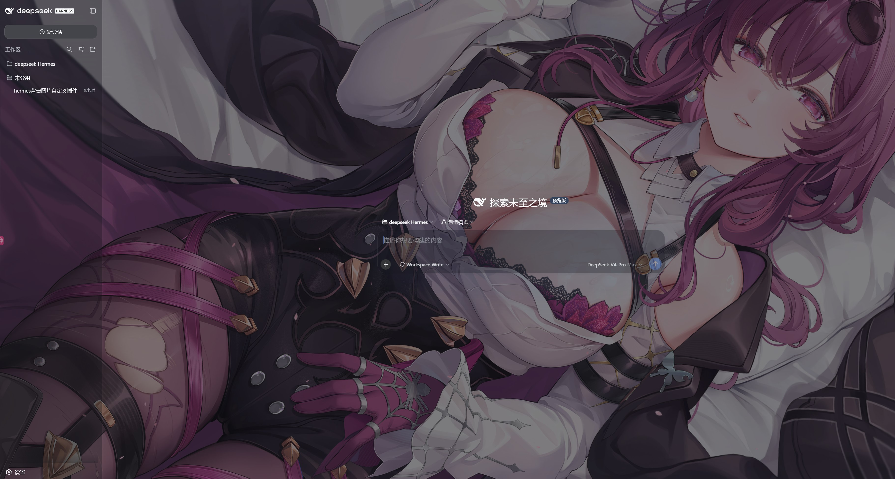

# dsh-background

[](https://dsh-plugin.org/plugins/retmon2333/dsh-background)
[](./LICENSE)
[](https://deepseek.com/harness)
[](https://github.com/topics/dsh-plugin)

> **一句话价值**：给 DeepSeek Harness Web 换上本机壁纸（单图 / 文件夹轮播），可调透明、模糊、遮罩与樱花／雪花特效，侧栏与输入框也能半透出壁纸。

DeepSeek Harness（DSH）Web 背景壁纸插件。标准 DSH bundle + client 插件，可通过 `dsh plugin` 安装／卸载。社区项目，**非 DeepSeek 官方出品**。

---

## 截图

### 设置页

<p align="center">
  
  
</p>

### 主界面

<p align="center">
  
  
</p>

---

## 特性

- **启用开关**：关闭后还原默认 UI，设置项变灰
- **单张图片 / 文件夹轮播**：本机路径；顺序或随机；间隔与叠化
- **画面调节**：填充方式、透明度、模糊、遮罩颜色／透明度、面板透明度
- **扩展半透明**：左侧栏、消息输入框（均默认开）；对话列与轨迹等主区透出壁纸
- **特效**：樱花／雪花飘落（密度、速度可调）
- **设置入口**：设置 → 背景

---

## 目录结构

```text
dsh-background/
├── package.json           # DSH bundle + client 元数据
├── cordis.patch.yml       # 插件挂载声明
├── README.md
├── LICENSE
├── 1.jpg … 4.jpg          # README 截图
├── assets/
│   └── default-wallpaper.jpg   # 默认单图（可替换）
├── lib/
│   ├── index.js           # Host：settings + 图片 HTTP
│   └── client.js          # Client：设置页 + 壁纸层 + 特效
└── src/                   # TypeScript 源码（开发用）
```

---

## 安装

**Profile：`web`**

装完后请**完整重启** `dsh web`，再 F5 刷新浏览器，打开 **设置 → 背景**。用 `github:` 安装后，也可在 DSH **插件管理**页更新。

### 方式 A：从 GitHub 安装（推荐）

```powershell
dsh plugin --profile web add github:retmon2333/dsh-background
```

需要代理时：

```powershell
$env:http_proxy="http://<ip>:<port>"; $env:https_proxy="http://<ip>:<port>"
dsh plugin --profile web add github:retmon2333/dsh-background
```

### 方式 B：本地 link 安装

在**仓库根目录**（有 `package.json` 的目录）先构建再安装：

```powershell
pnpm install
pnpm build
dsh plugin --profile web add link:.
```

路径含空格时，建议先建无空格 junction：

```powershell
New-Item -ItemType Directory -Force -Path "$env:USERPROFILE\.dsh\plugins" | Out-Null
cmd /c mklink /J "$env:USERPROFILE\.dsh\plugins\dsh-background" "D:\你的路径\dsh-background"
dsh plugin --profile web add "link:$env:USERPROFILE\.dsh\plugins\dsh-background"
```

### 方式 C：npm 包名（发布到 npm 后）

```powershell
dsh plugin --profile web add dsh-background
```

### 给 AI 的安装说明（可直接复制）

```text
请帮我安装 DSH 插件 dsh-background。

步骤：
1. 确保 pnpm 可用
2. 安装（任选）：
   - GitHub：dsh plugin --profile web add github:retmon2333/dsh-background
   - 本地：在插件根目录 pnpm build 后执行 dsh plugin --profile web add link:.
3. 完整重启 dsh web，浏览器 F5
4. 打开 设置 → 背景 验证

自检：dsh --profile web --dump-config 应能看到 dsh-background
```

### 默认壁纸

可选替换：

```text
<plugin>/assets/default-wallpaper.jpg
```

首次安装默认单图模式指向该路径。若本机 `settings.yaml` 里已有 `dsh-background` 段，以已保存配置为准。

---

## 卸载

```powershell
dsh plugin --profile web remove dsh-background
```

然后重启 `dsh web`。

卸载**不会**删除用户配置。若要恢复出厂默认，编辑 `%USERPROFILE%\.dsh\settings.yaml`，删除其中的 `dsh-background:` 整段。

### 更新

```powershell
# GitHub 安装的包
dsh plugin --profile web update dsh-background

# 或重新 add
dsh plugin --profile web remove dsh-background
dsh plugin --profile web add github:retmon2333/dsh-background
```

本地 `link:` 安装：改源码 → `pnpm build` → 重启 `dsh web`。

---

## 功能一览

| 能力       | 说明                             |
| ---------- | -------------------------------- |
| 启用开关   | 关闭后还原默认界面               |
| 单张图片   | 本机绝对路径，宿主 HTTP 读取     |
| 图片文件夹 | 系统选夹；顺序／随机；间隔与叠化 |
| 填充       | 居中／覆盖／包含／拉伸           |
| 画面       | 透明度、模糊、遮罩、面板透明度   |
| 扩展       | 侧栏、消息输入框半透明           |
| 特效       | 樱花／雪花（密度、速度）         |

---

## 配置存放位置

| 项         | 路径                                                                      |
| ---------- | ------------------------------------------------------------------------- |
| 用户设置   | `%USERPROFILE%\.dsh\settings.yaml`（Linux/macOS：`~/.dsh/settings.yaml`） |
| 本插件分节 | 文件内 `dsh-background:`                                                  |

---

## 权限与兼容性

| 项       | 说明                                             |
| -------- | ------------------------------------------------ |
| Profile  | **web**                                          |
| 本地文件 | 读取配置的图片／文件夹；可选系统文件／目录选择器 |
| 网络     | 壁纸不经第三方；仅本机 `/dsh-background/...`     |
| 外部服务 | 无                                               |
| 导出     | Host：`apply(ctx)`；Client：`dsh.client` 注入    |

---

## 验证

```powershell
dsh --profile web --dump-config | Select-String -Pattern "background"
```

- dump-config 中可见 `dsh-background`
- 重启并 F5 后出现 **设置 → 背景**
- 配置图片后主界面透出壁纸／特效

HTTP 路由自检（宿主启动后、`http://127.0.0.1:3080`）：

```powershell
# 单图模式：返回图片字节（未配置时 400 image-not-configured）
curl.exe -o NUL -w "%{http_code}`n" http://127.0.0.1:3080/dsh-background/file

# 文件夹模式：返回 JSON { folder, images[] }（未配置时 400）
curl.exe http://127.0.0.1:3080/dsh-background/folder/list
```

> macOS/Linux 用 `curl -o /dev/null -w "%{http_code}\n" ...`。

---

## 常见问题

- **设置里没有「背景」**：确认 `add` 成功且 dump-config 有条目；必须完整重启 `dsh web`，再 F5。
- **pnpm 报 `allowBuilds`／`ignored build scripts`**：DSH 默认拦截 git 插件的 `prepare` 构建脚本。把报错里打印的包名（通常是本插件 `dsh-background`）加进 profile 的 `pnpm-workspace.yaml`：

  ```yaml
  allowBuilds:
    - dsh-background
  ```

  文件位于 `%USERPROFILE%\.dsh\profiles\web\pnpm-workspace.yaml`（Linux/macOS：`~/.dsh/profiles/web/pnpm-workspace.yaml`），改完重新 `dsh plugin --profile web add github:retmon2333/dsh-background`。

- **Windows 装失败报 `ERR_PNPM_EPERM: symlink`**：多为系统符号链接权限问题。开启「开发者模式」（设置 → 隐私与安全 → 开发者选项），或以管理员身份运行终端；或改用无空格路径的 `link:` 本地安装。
- **改了代码不生效**：`pnpm build` 后重启宿主（不要只刷页面）。
- **路径含空格装失败**：用 junction 的无空格 `link:`。
- **重装后还是旧设置**：删 `settings.yaml` 里的 `dsh-background:` 段。
- **默认壁纸不显示**：确认 `assets/default-wallpaper.jpg` 存在，且未被用户配置覆盖。
- **GitHub 安装 404**：仓库须公开，仓库名与 `github:用户/仓库` 一致。

---

## 开发

```bash
pnpm install
pnpm build
pnpm watch
```

---

## License

[MIT](./LICENSE)
